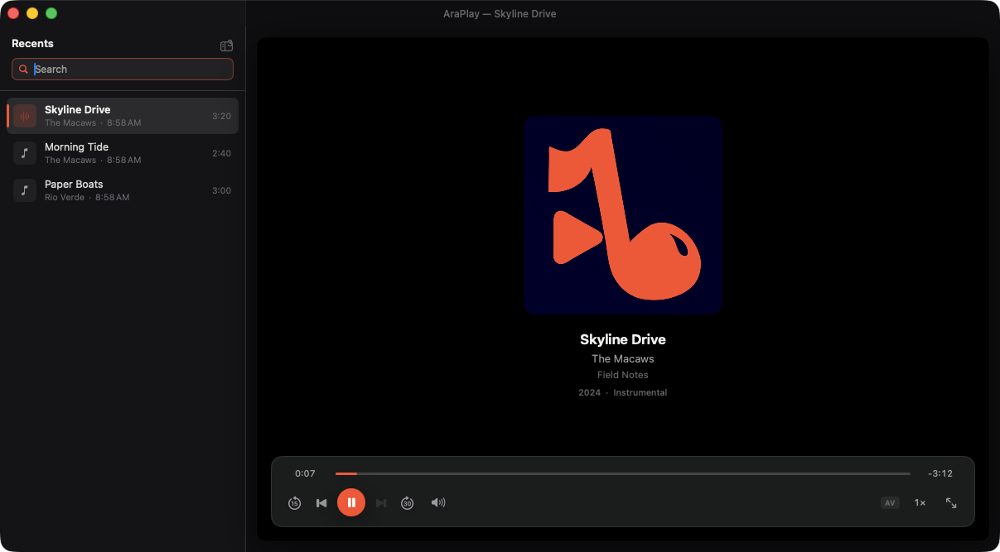

# AraPlay

A native, fast, simple media player for macOS.

AraPlay plays your local audio and video files — all of them, from MP3 and FLAC
to MKV and WebM — in a single dark window that stays out of the picture's way.
No library to import into, no accounts, no network access at all: it opens
files, plays them beautifully, and remembers where you left off.



## Features

- **Plays practically anything.** Two engines behind one interface:
  AVFoundation for the formats macOS handles natively (hardware decode, low
  power draw), and [mpv](https://mpv.io) for everything else — MKV, WebM, Opus,
  Vorbis, APE, WavPack, DSD and the rest. Files route automatically; if
  AVFoundation chokes mid-file, playback restarts on mpv at the same position
  without you noticing.
- **Recently played, done properly.** The last 200 files, searchable (⌘F,
  matching titles, artists, albums and folders, accent-insensitive). Entries
  track their files by bookmark, so a moved or renamed file heals itself;
  only a genuinely deleted one is shown struck through as missing.
- **Resume where you stopped.** Every file remembers its playback position,
  shown as a thin progress line under its row. Files watched to the end start
  over cleanly, and the play button becomes a replay button.
- **Reads your tags.** Title, artist, album, year, genre, track number,
  composer and embedded cover art — ID3, iTunes/MP4 and Matroska/Ogg
  spellings alike. Untagged files fall back to their file name, never to
  "Unknown".
- **A real macOS citizen.** Registers as a handler for every format it plays
  (Settings offers one-click "Make Default" for audio and video), publishes to
  Control Center / Now Playing with artwork, answers the hardware media keys,
  offers the last ten files from its Dock menu, and reuses one window for
  every file the Finder hands it.
- **Single window, no clutter.** Transport controls fade out during video
  playback and return on mouse movement. Double-click the picture for full
  screen — where the video runs edge to edge. The recents sidebar collapses
  (⌘\) and resizes by dragging its edge.

## Requirements

- Apple Silicon Mac
- macOS 14 or later (developed and tested on macOS 26)

## Building

Requires Xcode 16+ and [XcodeGen](https://github.com/yonaskolb/XcodeGen)
(`brew install xcodegen`):

```bash
xcodegen generate
xcodebuild -project AraPlay.xcodeproj -scheme AraPlay -configuration Release build
```

`project.yml` is the source of truth; `AraPlay.xcodeproj` is generated and not
checked in. The first build downloads [MPVKit](https://github.com/mpvkit/MPVKit)
(prebuilt mpv + FFmpeg) via Swift Package Manager.

To install: copy `AraPlay.app` to `/Applications`, launch it once from there,
then use **Settings → Default Player** to claim audio and video file types.
macOS stores default apps per file type — there is no single "default media
player" switch — so each button claims every common type in its group at once.

## Keyboard and mouse

| | |
|---|---|
| Space | Play / pause (replay at end) |
| ⌘← / ⌘→ | Previous / next from recents¹ |
| ← / → | Back / forward 10s |
| ⇧← / ⇧→ | Back / forward 60s |
| ↑ / ↓ | Volume |
| ⌘M | Mute |
| ⌘O | Open file |
| ⌘F | Search recents |
| ⌘\ | Toggle sidebar |
| ⌘. | Stop |
| Double-click video | Toggle full screen |
| Click video (full screen) | Show / hide controls |
| Double-click title bar | Zoom (fill screen / restore) |

¹ Previous follows the audio-player convention: it restarts the current file
unless pressed within the first two seconds, where it steps back a file.

## Testing

```bash
xcodebuild -project AraPlay.xcodeproj -scheme AraPlay test
```

Unit tests cover the logic that fails silently when it regresses: tag parsing
and normalization, the metadata merge, the recents LRU (ordering, capacity,
resume semantics, persistence, missing-file tracking), engine routing, and
time formatting. The engines and UI are deliberately not unit-tested — they
are thin adapters over AVFoundation, libmpv and SwiftUI, and are exercised by
playing real files. See [docs/ARCHITECTURE.md](docs/ARCHITECTURE.md) for the
full strategy and the mpv integration notes.

## Privacy and security

AraPlay makes **no network connections** — no telemetry, no artwork lookup,
no update checks. mpv is configured hermetically: `ytdl` and all network
protocol handling off, user config files ignored, all built-in Lua scripts
disabled (which also means the app runs under the Hardened Runtime with no
JIT entitlements). The only things it writes are its recents list in
`~/Library/Application Support/AraPlay/` and standard user defaults.

## Acknowledgments

AraPlay embeds, via [MPVKit](https://github.com/mpvkit/MPVKit):

- [mpv](https://mpv.io) — LGPL-2.1+
- [FFmpeg](https://ffmpeg.org) — LGPL-2.1+
- [libplacebo](https://libplacebo.org), libass, dav1d and friends — see their
  respective licenses

The full corresponding source of this application is this repository, which
satisfies the LGPL's relinking requirement for the statically linked builds.

## License

AraPlay is released under the [MIT License](LICENSE). The bundled playback
components keep their own licenses — see Acknowledgments above.

## Limitations

- Local files only; no streaming, no playlists (recents is the library).
- No subtitle track picker yet — matching sidecar subtitles load automatically.
- Not sandboxed and ad-hoc signed; distribution builds need a Developer ID
  and notarization.
- Resizing a window during mpv playback rebuilds the engine after the resize
  settles (a brief interruption) — see the architecture notes for why.
